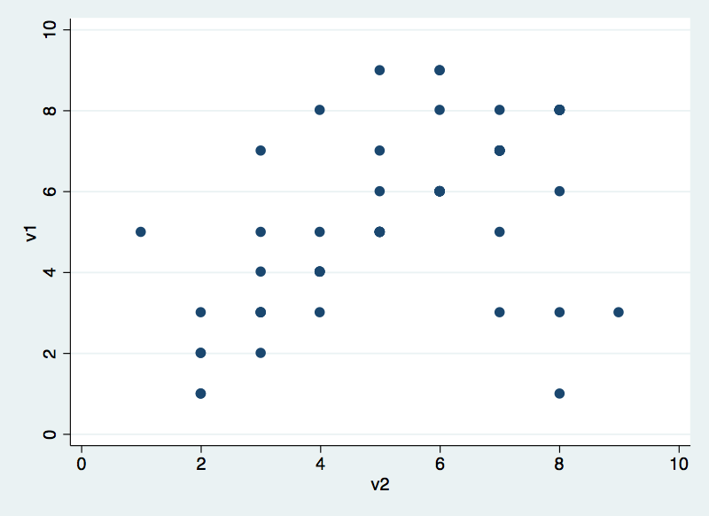
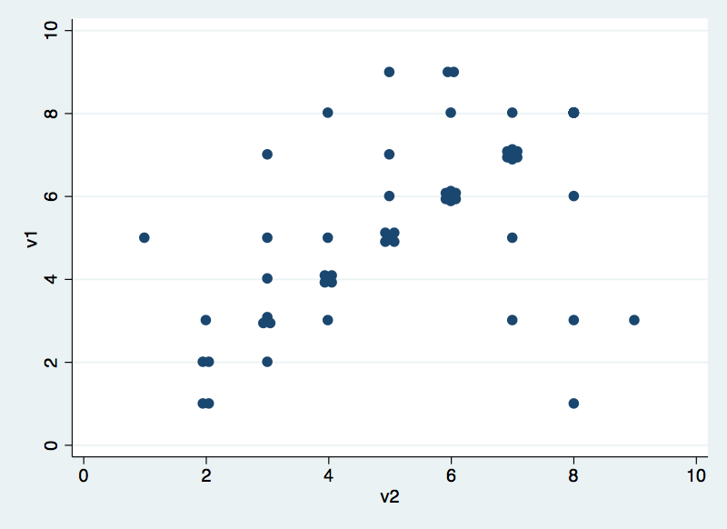

`neat` layout example
=====================

the **neat3.dta** includes 2 discrete variables named **v1** and **v2**.
Let's begin by creating a scatter plot in Stata:

          .  use "https://raw.githubusercontent.com/haghish/neat/master/test/neat3.dta", clear
          
          .  scatter v1 v2 
          
          
          

Now let's apply the **`neat`** engine. This will change the duplicated
observations in **v1** and **v2** variables.

          .  neat v1 v2
          
          . scatter v1 v2
          
          
          

