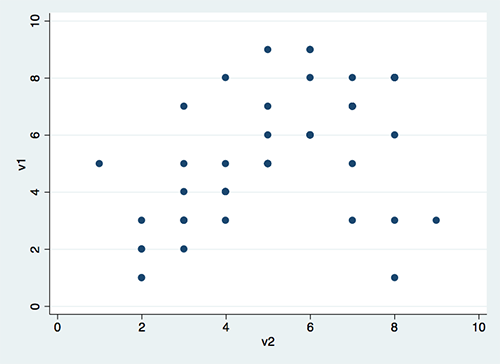
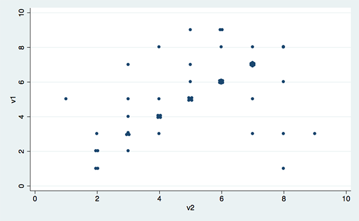
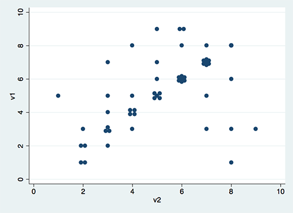

`neat` layout example
=====================

the **neat3.dta** includes 2 discrete variables named **v1** and **v2**.
Let's begin by creating a scatter plot in Stata:

          .  use "https://raw.githubusercontent.com/haghish/neat/master/test/neat3.dta", clear
          
          .  scatter v1 v2 
          
          
          

Now let's apply the **`neat`** engine. This will change the duplicated
observations in **v1** and **v2** variables.

          .  neat v1 v2
          
          . scatter v1 v2
          
          
          

`neat` options
--------------

The `neat` layout engine takes several options which are identical to
the options of the **scatter** command in Stata, used for altering the
size of symbols, width of the graph, and height of the graph. If you
wish to alter the default size of the scatter plot in Stata, you can
apply the same options to the `neat` engine, so that it takes the final
shape of the scatter plot into account, when it calculates the
geometiric distances between the duplicated observations.

For example, let's assume you wish to reduce the size of the symbols in
the previous figure. You can use the **msize(num)** option to change the
size of the symbil. For this, you should give the option a real number.
For example, `1.1`, which is smaller than the default value of the
`msize` (i.e. **1.5**).

We can also alter the size of the graph. For instance, let's make the
graph wider by changing the \_\_xsize to 6.5, which is larger than the
default value (i.e. 5.5):

          .  use "https://raw.githubusercontent.com/haghish/neat/master/test/neat3.dta", clear
          
          . neat v1 v2 , msize(1.1) xsize(6.5)
          
          . scatter v1 v2, msize(1.1) xsize(6.5)
          
          
          

Despite the scalings, the graph still looks fine and the geometric
shapes are in place. Now let's alter another variable, the **dsize**
option which increases the distance between the geometric shapes,
resulting in larger shapes. The default value is 5, so we can try 7!

          .  use "https://raw.githubusercontent.com/haghish/neat/master/test/neat3.dta", clear
          
          . neat v1 v2 , dsize(7) 
          
          . scatter v1 v2
          
          
          

